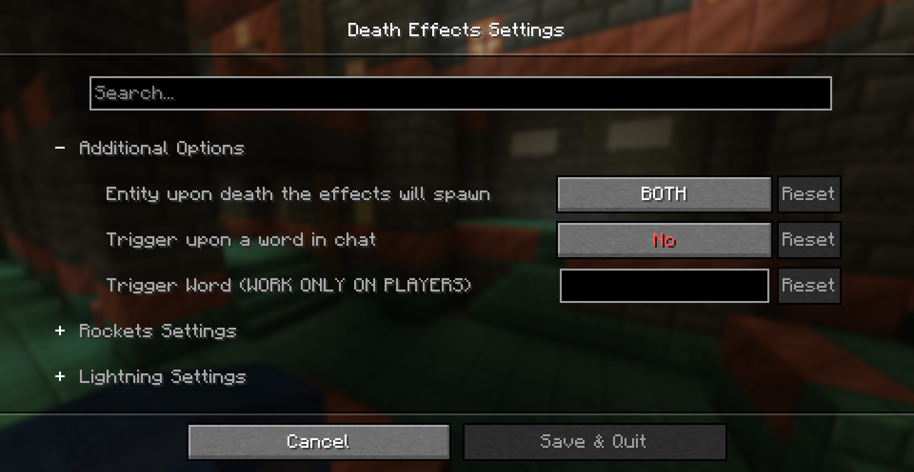
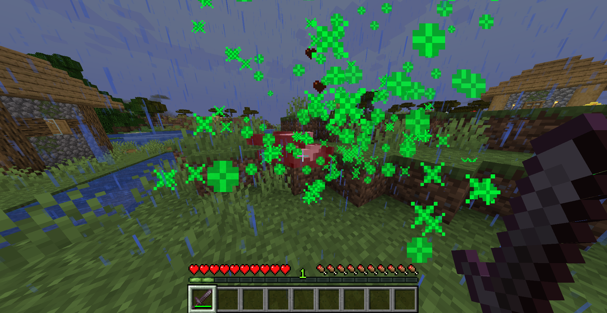

# Death Effects By I-No-oNe
-----------------
```lua
How to use?
1. Install Fabric API + Cloth Config + Mod Menu.
2. Open The death effect config screen via mod menu.
3. Change settings as you want.
4. Enjoy!
```
--------------------
## Showcase:
### Config

--------------------
### In-game Example:

-----------------

**BE AWARE THAT YOU MUST TO DOWNLOAD THE [**CLOTH-CONFIG**](https://modrinth.com/mod/cloth-config/) LIBRARY IN ORDER TO THE MOD TO WORK!**

------------------
**tysm for using this mod** 🙏

